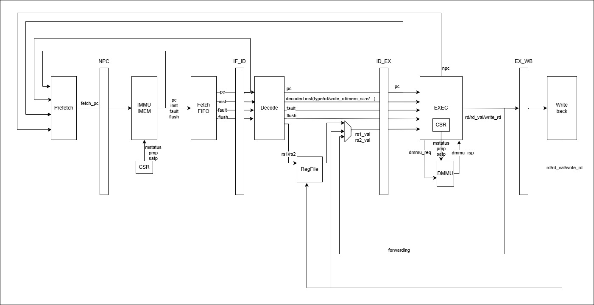

# Turtle_RV32: RISC-V System Emulator

**Turtle_RV32** is a SystemC-based RISC-V architectural emulator supporting the **RV32IMAC** instruction set and virtual memory sv32.
## Getting Started

### Prerequisites
-   **SystemC**
-   **CMake**  
-   **GNU C/C++ Compiler** 
-   **RISC-V GNU Toolchain** \
		 `riscv32-unknown-linux-gnu-`\
		 `riscv64-unknown-linux-gnu-`\
		 `riscv64-unknown-elf-`\
		 `riscv32-unknown-elf-`
## 1. Build
```
# Generate build files 
cmake CMakeLists.txt 
# Compile the emulator 
make -j$(nproc) 
# The resulting binary 'emu' is the main entry point 
```
## 2. Verification & Testing
The project supports three distinct execution modes. Detailed build and setup instructions for each can be found in the `tests/` directory.
### 1. RISC-V ISA Unit Tests

Used for verifying individual instruction behavior using the official `riscv-tests` suite.

-   **Documentation:** tests/riscv-tests.md
    
-   **Command:** `./emu --mode=riscv-tests --elf=<path_to_elf>`
    

### 2. RISC-V Architectural Compliance

Used for comparing MyCPU signature against the Spike golden model via the RISCOF framework.

-   **Documentation:** tests/riscv-arch-test.md
    
-   **Command:** `./emu --mode=arch-test --elf=<elf> --sig=<out.sig> --start=<addr> --end=<addr>`
    

### 3. Linux Boot

Booting a full Linux kernel with OpenSBI and a BusyBox-based initramfs.

-   **Documentation:** tests/riscv-linux.md
    
-   **Command:** `./emu --mode=linux --linux=<Image> --sbi=<fw_jump.bin> --dtb=<minimal.dtb>`\
Type ":r" to start running the code.(See run_ui_console in src/utils.cpp for more)


-  **System Map**
The emulator assumes the following physical memory layout for Linux boot:

|Base Address|Top Address |Component|Description|
|--|--|--|--|
|0x1000_0000|0x1000_0100|**UART**|UART Ports|
|0x2000_0000|0x2001_0000|**CLINT**|(TODO:IPI software interrupt)|
|0x3000_0000|0x3400_0000|**PLIC**|(TODO:VirtIO)|
|0x8000_0000|0x800F_FFFF|**OpenSBI**|Machine-mode firmware|
|0x8010_0000|0x803F_FFFF|**DTB**|Hardware description|
|0x8040_0000|0xFFFF_FFFF|**Linux Image**|kernel&rootfs|

## 4. DATAPATH



## 5. Todo

    
1. **Storage:** Add **VirtIO-Block** device support to allow mounting persistent disk images.
    
2. **Cache:** Implement **Instruction and Data Caches** to simulate memory latency more accurately. 

3. **Branch Predictor:** Implement **Branch Predictor** to load instruction more efficiently.

4. **Multi-Cores:** Implement SMP system.

5. **UI** Implement better UI.
    
6. **Performance** Improve the speed of simulation